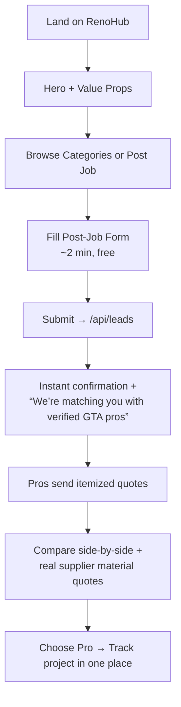
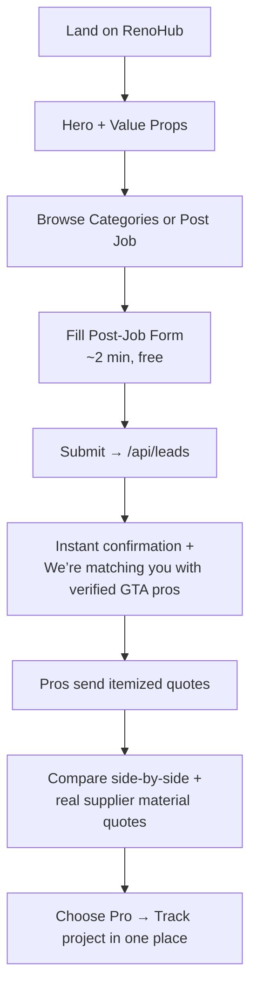
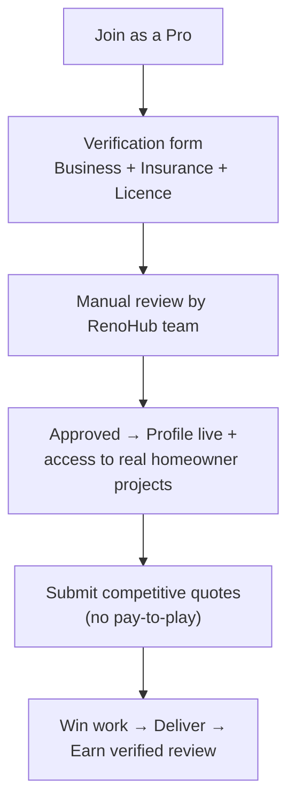
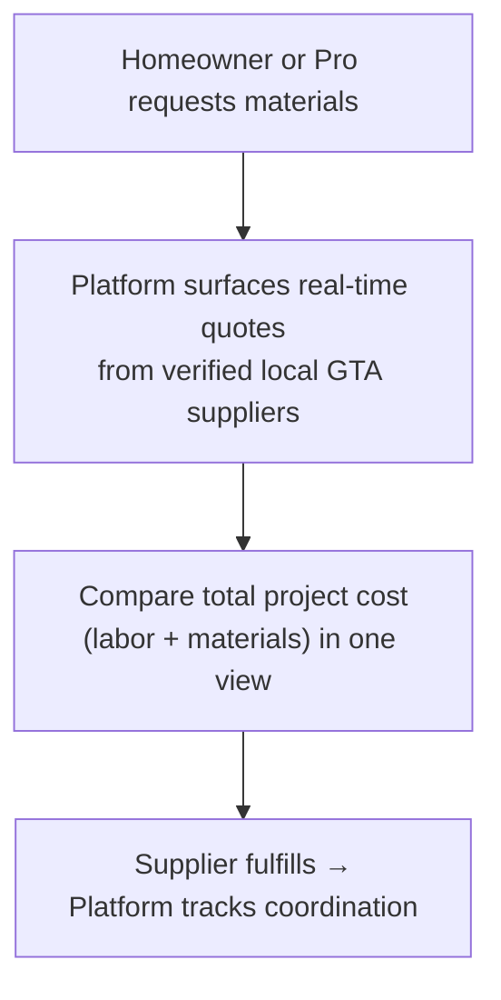
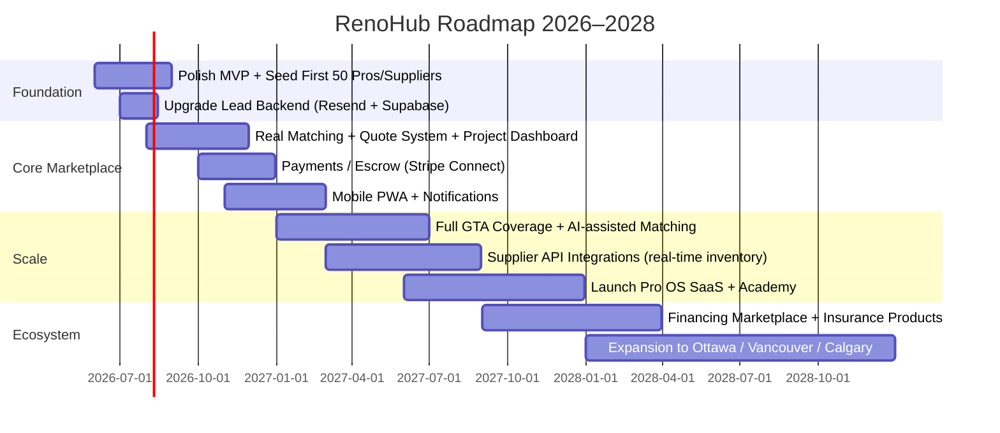

# RenoHub — Renovate Smarter in Toronto & the GTA

**One platform. Homeowners, verified local pros, and suppliers — perfectly aligned.**

[](https://nextjs.org/)
[](https://www.typescriptlang.org/)
[](https://tailwindcss.com/)
[](https://thehomestars-ca.vercel.app/)
[](#)

**Live Sites**  
- Production: [https://thehomestars.ca](https://thehomestars.ca/)  
- Vercel: [https://thehomestars-ca.vercel.app](https://thehomestars-ca.vercel.app/)

**Repository**: [github.com/iceccarelli/thehomestars.ca](https://github.com/iceccarelli/thehomestars.ca)

**Working Name / Brand**: RenoHub (see [Branding & Legal](#branding--legal-strategy-critical) for critical trademark guidance)

---

## Executive Summary & Vision

RenoHub is building the most trusted, transparent, and locally-native home renovation marketplace for the Greater Toronto Area (GTA). 

It connects three sides that are currently fragmented and adversarial:

- **Homeowners** who want a stress-free, trustworthy renovation without chasing quotes or gambling on unknown contractors.
- **Verified local Pros** (general contractors, renovators, specialists) who want high-quality, ready-to-quote leads without paying for placement or competing on who spends the most on ads.
- **Local Suppliers** (lumber, tile & stone, cabinetry, plumbing, electrical, etc.) who want to reach active, real projects instead of cold outreach.

**Core Philosophy** (visible in every pixel and line of code):
- **Verification first** — Insurance + licence checked before any pro appears.
- **Reviews only from completed, verified jobs** — No fake reviews, ever.
- **No paid placement, ever** — Matching based on fit, reviews, availability, and price — not wallet size.
- **Integrated supply chain** — Real-time material quotes inside the same platform so projects don’t stall on sourcing.
- **GTA-native** — Deep local knowledge (permits, neighborhoods, logistics, seasonal realities).

The current codebase is a **premium, production-grade marketing + lead-generation foundation** that already looks and feels like a high-trust platform (not another generic marketplace). It is ready for real users today while the backend and matching engine are built in parallel.

**Goal**: Become the default operating system for home renovations in the GTA (and eventually Canada) by making the process transparent, aligned, and dramatically better than the status quo.

---

## Current Status — What Works Perfectly Today (June 2026)

The platform is **live and fully functional** as a high-conversion marketing site + lead capture system.

### What Is Fully Working
- **Beautiful, premium design system** (spruce green + brass accents + cream backgrounds, Fraunces display font + Inter body, custom cinematic/Ken Burns animations, excellent focus states and accessibility).
- **All primary routes** implemented with consistent UX:
  - `/` — High-converting homepage with hero, value props, categories, how-it-works teaser, featured pros/suppliers, final CTA.
  - `/how-it-works` — Detailed 4-step process + FAQ.
  - `/pros` — Browse verified pros (with category filtering ready).
  - `/for-pros` — Onboarding/lead capture for professionals.
  - `/suppliers` — Supplier directory + “List your supply business” flow.
  - `/post-job` — Homeowner project posting form (free, ~2 minutes).
  - `/contact` — Contact form + map.
- **Lead capture API** (`/api/leads`) with strong validation for `job`, `pro`, `supplier`, and `contact` types. Logs to console + appends to `data/leads.json` (dev only).
- **Full SEO & social metadata** (Open Graph, Twitter cards, dynamic OG image generator, proper title templates).
- **Responsive, accessible, fast** (Tailwind 4, modern Next.js 16 + React 19, server components where appropriate).
- **Single source of truth branding** in `app/brand.ts`.
- **Professional header + footer** with all social links and contact info.
- **Not-found page** and clean error handling patterns.

### Tech Stack (Exactly as Implemented)
| Layer          | Technology                          | Notes |
|----------------|-------------------------------------|-------|
| Framework      | Next.js 16 (App Router)            | Latest stable |
| Language       | TypeScript (strict)                | 90%+ of codebase |
| Styling        | Tailwind CSS 4 + PostCSS           | Custom design tokens in `globals.css` |
| Icons          | lucide-react                       | Clean, consistent |
| Fonts          | Fraunces (display) + Inter (body)  | Self-hosted + Google preconnect |
| Deployment     | Vercel                             | Zero-config, excellent DX |
| Forms / Leads  | Native + `/api/leads`              | Validation + basic persistence |
| No heavy deps  | No Prisma, no Supabase, no Stripe yet | Intentional — keep lean until product-market fit |

**Current limitations (by design)**:
- Pros & Suppliers data are currently static/empty (shows beautiful empty-state CTAs — perfect for early stage).
- Lead persistence is file-based (`data/leads.json`) — works locally, ephemeral on Vercel. **This is the correct early-stage approach**.
- No user accounts, auth, real-time matching, payments, or project dashboard yet.

**Verdict**: The frontend and user-facing experience are **production quality and already delightful**. Everything that is built works exactly as intended. The foundation is solid, opinionated, and ready to scale.

---

## Branding & Legal Strategy (Critical — Read This First)

From `app/brand.ts`:

```ts
// ⚠️ PLACEHOLDER. Do NOT ship "thehomestars"/"HomeStars" as the visible brand:
// it is confusingly similar to HomeStars (homestars.com, Toronto, IAC/Instapro)
// and operating a GTA home-reno marketplace under it invites a CIRA CDRP
// complaint that could delete the domain. Pick a distinctive, CIPO-clearable
// name, run a knockout search, then change ONLY this value.
//
// thehomestars.ca can remain as a passive 301 redirect to the real brand.
export const BRAND = "RenoHub";
```

**Current canonical brand**: **RenoHub**

**Domain strategy**:
- Keep `thehomestars.ca` as a **permanent 301 redirect** to the primary RenoHub domain (recommended: `renohub.ca` or `renohub.com` — secure both immediately).
- Never brand the marketplace itself as “HomeStars” or “thehomestars”.

**Contact single source of truth** (used in footer, structured data, emails):
- Maria Luisa Grimaldi
- service@thehomestars.ca
- +1 (416) 249-1276
- 32 Norfield Crescent, Toronto, ON

**Action required before heavy marketing or paid acquisition**:
1. Run full Canadian trademark search (CIPO) + common-law + domain + social handle clearance for “RenoHub”.
2. Secure `renohub.ca`, `renohub.com`, and key social handles.
3. Decide on final legal entity structure.

---

## User Flows & Experience (Mermaid Diagrams)

### Homeowner Journey (Current + Near-Term)


#### 1. Homeowner Journey (replace the first flowchart)


#### 2. Pro Onboarding & Value (replace the second flowchart)


#### 3. Supplier Integration (Unique Moat) (replace the third flowchart)


All other parts of the README (text, tables, Gantt chart, structure, etc.) remain excellent and do not need changes.

---

## Monetization Strategy: Products & Services (Aligned, Trust-Preserving)

**Guiding principle**: Revenue must reinforce trust and alignment — never undermine it. No paid placement, no auctioned leads, no banner ads.

### Phase 1 Revenue (First 6–12 months)
| Stream                        | Model                                      | Why It Works                                                                 | Est. Take Rate / Pricing (hypothesis) |
|-------------------------------|--------------------------------------------|----------------------------------------------------------------------------------|---------------------------------------|
| **Pro Subscriptions**         | Monthly/annual access to platform + tools | Pros pay for quality leads + credibility badge + project tools, not placement | $99–299/mo or $799–2499/yr           |
| **Success / Completion Fee**  | Small % of job value on completed projects (optional escrow) | Aligned — we only win when homeowner + pro win                              | 5–8% of job value                    |
| **Supplier Commissions**      | % of materials sourced through platform   | Suppliers get real demand; platform adds coordination value                  | 3–6%                                 |
| **Premium Supplier Listings** | Featured or “Pro Supplier” tier           | Higher visibility in sourcing step without breaking “no paid placement” for pros | $149–499/mo                          |

### Phase 2+ Products & Services (High-Margin, Defensible)
- **RenoHub Project OS** (SaaS for Pros): Scheduling, client portal, document vault, change-order management, automated reviews collection.
- **Curated Material Kits & Private-Label Products** (with supplier partners).
- **RenoHub Financing Marketplace** (white-label or referral revenue from lenders).
- **Permit & Inspection Concierge** (white-glove service for complex Toronto/GTA jobs).
- **RenoHub Academy + Certification** for pros (training + badging that increases win rate).
- **Market Intelligence Reports** (anonymized data sold to suppliers, manufacturers, real estate firms).
- **Insurance & Warranty Products** tailored to GTA renovations.

**Key rule**: Every revenue stream must make the core marketplace experience **better**, not worse.

---

## Comprehensive Roadmap (Phased)



### Phase 0 (Now – Done)
- Premium frontend + design system
- All marketing + onboarding pages
- Lead capture foundation
- Branding guardrails

### Phase 1: Launch & Seed (Next 8–12 weeks)
- Replace file-based leads with **Resend** (email) + **Supabase** (Postgres + auth + storage).
- Manually onboard and verify first 30–50 high-quality pros and 15–20 suppliers.
- Launch in 2–3 pilot neighborhoods (e.g. North York + Etobicoke + one in 905).
- Instrument analytics + basic CRM (leads in Supabase + Airtable or Notion view).
- Content engine: 8–10 SEO cornerstone pieces + neighborhood guides.

### Phase 2: Real Marketplace (Months 3–9)
- Homeowner project dashboard
- Pro quote submission + side-by-side comparison UI
- Integrated supplier quote requests
- Verified review system (only after job marked complete + both parties confirm)
- Basic notifications (email + in-app)

### Phase 3: Scale & Automation (Months 9–18)
- Matching algorithm (fit score based on category, location, reviews, response time, capacity)
- Payments + optional escrow
- Pro analytics dashboard
- Mobile experience (PWA first)
- First revenue automation

### Phase 4: Ecosystem (Year 2+)
- RenoHub Pro OS (SaaS)
- Financing + insurance verticals
- Data products
- Geographic expansion

---

## Go-to-Market Without Heavy Advertising Spend

**Primary channels (ranked by expected ROI early)**:

1. **SEO + Content** (highest leverage)
   - Neighborhood + project-type long-tail pages
   - Cost calculators, permit guides, “what to expect” series
   - Before/after case studies (with permission)

2. **Partnerships & Referrals**
   - Real estate agents (staging + post-purchase reno)
   - Mortgage brokers & home inspectors
   - Interior designers & architects
   - Property management companies (multi-unit)

3. **PR & Thought Leadership**
   - Local media (Toronto Star, BlogTO, reno podcasts)
   - “The State of GTA Renovations” annual report (data-backed)

4. **Community & Owned Channels**
   - RenoHub Homeowner Circle (private community)
   - Free workshops/webinars in Toronto
   - Strong referral program (homeowner + pro incentives)

5. **Pro Word-of-Mouth**
   - Exceptional first 50 pros become your sales force

**Rule**: Spend money on **product quality and verification** before paid acquisition. Early users must have an outstanding experience so they become advocates.

---

## Technical Improvements & Polish (Prioritized)

**Immediate (this month)**
- Add `.env.example` + move sensitive values out of `brand.ts` where appropriate.
- Create `/data` folder + `.gitignore` rule for `data/leads.json`.
- Add rate limiting + basic spam protection to `/api/leads`.
- Implement proper error boundaries and loading states.
- Add sitemap + robots.txt generation.

**Next 1–2 months**
- Migrate leads to Supabase + Resend.
- Build real Pro/Supplier data models + admin verification UI (internal).
- Add photo upload to post-job form (Supabase Storage).
- Structured data (LocalBusiness, Service, FAQPage) on key pages.

**Ongoing**
- Playwright or Cypress E2E for critical flows.
- Sentry or Vercel error tracking.
- Analytics (Vercel Analytics + privacy-friendly alternative).
- Accessibility audit (already strong, make it excellent).

---

## Local Development

```bash
git clone https://github.com/iceccarelli/thehomestars.ca.git
cd thehomestars.ca
npm install
npm run dev
```

Open [http://localhost:3000](http://localhost:3000)

**Environment variables** (create `.env.local`):
```env
NEXT_PUBLIC_SITE_URL=http://localhost:3000
# Add Supabase, Resend, Stripe keys when ready
```

**Useful scripts**
- `npm run build` — production build
- `npm run lint` — ESLint
- `npm run start` — production server locally

---

## Deployment

Currently deployed on **Vercel** (recommended).

**Custom domain**: Point `thehomestars.ca` (and `www`) as 301 redirect to primary RenoHub domain, or use Vercel’s domain configuration.

**Environment variables** on Vercel must match production values.

---

## Security, Privacy & Compliance (Canada)

- PIPEDA compliance for personal information.
- CASL (anti-spam) — all emails must have proper consent + unsubscribe.
- Ontario contractor licensing & insurance verification process (document everything).
- Future: consider escrow + trust account rules if holding funds.
- Data residency: prefer Canadian or SOC2-compliant providers.

---

## Key Metrics to Track (from Day 1)

**Leading indicators**
- # of project posts per week
- % of posts that receive 3+ quotes
- Time from post → first quote
- Pro & supplier application → approval conversion rate

**Lagging / Business metrics**
- Completed projects
- Average job value
- Take rate (platform revenue / GMV)
- NPS from homeowners & pros
- Repeat usage / referral rate

---

## Appendix: Key Files & Architecture Notes

- `app/brand.ts` — Single source of truth for brand, contact, socials, region.
- `app/layout.tsx` — Root metadata, fonts, SiteHeader + SiteFooter.
- `app/globals.css` — Complete design system (variables, buttons, cards, cinematic animations, reduced-motion support).
- `app/_components/` — All reusable UI (Hero, ProCard, SupplierCard, CineFrame, SectionBg, Btn, etc.).
- `app/_lib/` — Utilities and data (CATEGORIES, STEPS, PROS, SUPPLIERS, SHOWCASE_IMAGES, etc.).
- `app/api/leads/route.ts` — Current lead ingestion (replace with Supabase + Resend).
- `app/opengraph-image.tsx` — Dynamic OG image generation.

**Data philosophy**: Start with simple TypeScript arrays/objects. Move to database only when you have real usage patterns.

---

## Final Notes for AI Agents & Future Contributors

This is not “just another marketplace.”  
It is a **trust layer** for one of the highest-stakes, highest-friction consumer purchases a Canadian family will make.

Every design decision (premium aesthetics, no paid placement, verification gate, integrated supply, local focus, calm color palette) exists to reduce anxiety and increase completion rates.

**Success will come from**:
1. Ruthless verification quality in the early days.
2. Protecting the “no paid placement” promise at all costs.
3. Making the supply chain integration feel magical.
4. Obsessing over the first 100 projects until the flywheel spins on its own.

The codebase is clean, modern, and intentionally lightweight. It is ready for rapid, high-quality iteration.

Welcome to RenoHub.

Let’s renovate the way GTA homeowners experience their homes — for the better.

---

**Maintained by**: Maria Luisa Grimaldi & team  
**Last major update**: June 2026  
**Status**: Foundation complete. Ready for real users and backend acceleration.
